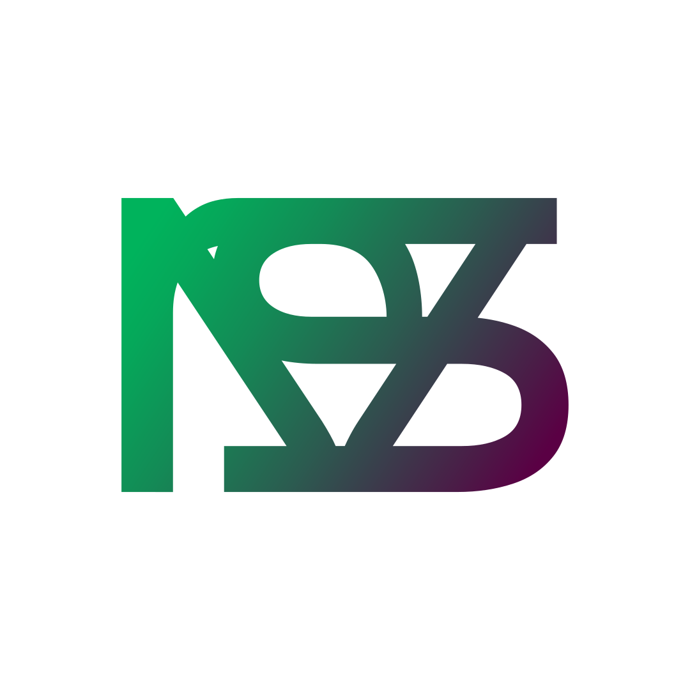

  

**Tecnologia que resolve.**

Desenvolvemos plataformas digitais integradas para transformar a gestão escolar — do planejamento pedagógico à portaria, passando por avaliações, ocorrências e comunicação.

 

---

## Ecossistemas

Operamos dois ecossistemas independentes — uma plataforma genérica multi-escola e uma implementação dedicada para a EE Prof. Christino Cabral.

---

### samba innovations — Plataforma Multi-Escola

Ecossistema genérico, multi-tenant, projetado para ser implantado em qualquer escola. Cada sistema é um submodule Git independente, orquestrado por Docker Compose, com banco PostgreSQL compartilhado e SSO centralizado.

> 9 sistemas ativos · 2 escolas · 44+ usuários · 2.829 aulas curriculares

 

<table>
<tr>
<td align="center" width="160">
<b>landing</b> 
Portal público e identidade visual da plataforma
</td>
<td align="center" width="160">
<b>sso</b> 
Login unificado — JWT compartilhado entre todos os sistemas
</td>
<td align="center" width="160">
<b>hub</b> 
Painel administrativo — escolas, usuários e sistemas
</td>
</tr>
<tr>
<td align="center" width="160">
 
<b>control</b> 
Frequência de alunos, carômetro e gestão de turmas
</td>
<td align="center" width="160">
 
<b>gate</b> 
Portaria eletrônica — entradas, saídas e custódia
</td>
<td align="center" width="160">
<b>mockflow</b> 
Simulados e avaliações com gabarito automático e leitura óptica
</td>
</tr>
<tr>
<td align="center" width="160">
 
<b>reserves</b> 
Reserva de espaços e recursos da escola
</td>
<td align="center" width="160">
 
<b>occurrences</b> 
Registro e acompanhamento de ocorrências disciplinares
</td>
<td align="center" width="160">
<b>less</b> 
Planejamento pedagógico, documentos PEI e horários
</td>
</tr>
</table>

 

→ [github.com/samba-innovations/samba-innovations](https://github.com/samba-innovations/samba-innovations)

---

### samba.escolacabral — EE Prof. Christino Cabral

Implementação dedicada para a Escola Estadual Prof. Christino Cabral (Bauru, SP). 11 aplicações integradas em servidor dedicado, com autenticação unificada e backup horário automático.

> 15 containers · 64 usuários · 3.476 aulas curriculares · 99/99 health checks ✔

 

<table>
<tr>
<td align="center" width="160">
<b>samba-access</b> 
SSO — autenticação unificada com JWT HS256 para todo o ecossistema
</td>
<td align="center" width="160">
 
<b>samba-paper</b> 
Documentação pedagógica — planos de aula, PEI, guias e ATAs em PDF/DOCX
</td>
<td align="center" width="160">
 
<b>samba-control</b> 
Gestão de alunos, responsáveis, carômetro e alunos PEI
</td>
</tr>
<tr>
<td align="center" width="160">
 
<b>samba-gate</b> 
Portaria inteligente — entradas/saídas, chamados e custódia
</td>
<td align="center" width="160">
 
<b>samba-edvance</b> 
Avaliações e simulados alinhados ao BNCC/SAEB com leitura óptica de gabaritos
</td>
<td align="center" width="160">
 
<b>samba-code</b> 
Ocorrências disciplinares e pedagógicas com workflow de resolução
</td>
</tr>
<tr>
<td align="center" width="160">
<b>samba-admin</b> 
Administração de usuários, roles e permissões por sistema
</td>
<td align="center" width="160">
 
<b>samba-flourish</b> 
Monitoramento ambiental via sensores IoT — temperatura e umidade
</td>
<td align="center" width="160">
 
<b>pombo-christino</b> 
Sistema de comunicados internos da escola
</td>
</tr>
</table>

 

→ [github.com/samba-innovations/samba.escolacabral](https://github.com/samba-innovations/samba.escolacabral)

---

## Stack

| Camada | Tecnologias |
|--------|-------------|
| **Frontend & Backend** | Next.js 15 (App Router · Server Actions) · TypeScript 5 · CSS Modules |
| **Banco de dados** | PostgreSQL 16 · Prisma ORM · schemas isolados por domínio |
| **Autenticação** | JWT HS256 via jose · SSO com tokens de uso único |
| **Infraestrutura** | Docker Compose · nginx (reverse proxy · SSL/TLS) · MinIO (S3) |
| **Geração de documentos** | PDFKit · docx.js |
| **Serviços especializados** | Python 3.12 · FastAPI · OpenCV (leitura óptica de gabaritos) |
| **Backup** | PostgreSQL dump horário · GitHub (orphan commits) · retenção 7 dias |
| **Segurança** | fail2ban · scram-sha-256 · headers HTTP · auditoria mai/2026 — 0 vulnerabilidades críticas |

---

&nbsp;&nbsp;**samba innovations** · Bauru, São Paulo · Brasil

